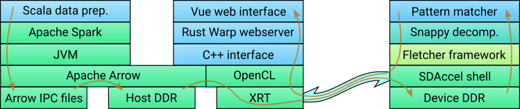

# Fletcher + Alveo demo

This demo shows how Fletcher can be combined with Alveo to very rapidly search
for patterns in a Snappy-compressed version of a Wikipedia database dump. The
demo does not make use of an index to speed this up; it actually scans through
the entire database for each query. This is of course not very realistic, but
it serves the purpose of demoing the throughput capabilities of Fletcher and
Alveo.

Besides the hardware and build scripts, this repository also provides data
preparation programs to convert Wikipedia database dumps to the appropriate
Arrow record batches, a webserver to present the demo in a user-friendly way,
and a command-line interface for testing the hardware more directly.
Specifically, the blue blocks in the diagram below are provided by this
repository.

## Structure

The repository is structured into several modules that are largely independent
from one another. Each module has its own folder and associated readme file.
The functions of the modules are:

 - `data`: Scala + Spark data preparation.
 - `optimize`: C++ repartitioning tool for the dataset generated by the above,
   optimizing the way the data is distributed over the kernel instances.
 - `fletchgen`: the scripts that were initially used to run Fletchgen, in order
   to generate a basic Fletcher interface for the Arrow schemas used.
 - `hardware`: the word match kernel and hand-optimized Fletcher interface.
 - `alveo`: the SDAccel/Alveo build scripts and host library/application to
   interface with the board, as well as a C++ CPU implementation of the kernel
   to serve as a baseline.
 - `wrapper`: Rust bindings for the aforementioned host library.
 - `client`: Vuetify-based frontend code for the web application.
 - `server`: Warp-based server code for the web application.
